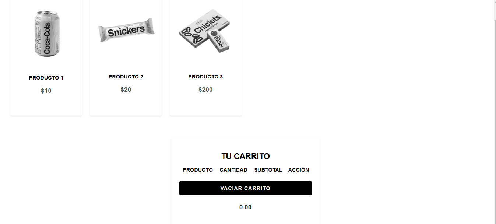

# Carrito Animado

## Descripción

Este proyecto es una implementación de un carrito de compras en una página web. Los productos pueden ser añadidos al carrito con un simple clic en el botón "Agregar". Si el producto ya existe en el carrito, solo se actualizará la cantidad. Además, se puede eliminar un producto del carrito o vaciarlo completamente.

## Características

- **Agregar productos al carrito**: Los productos se añaden al carrito con un solo clic.
- **Actualizar cantidad**: Si un producto ya está en el carrito, se aumenta la cantidad en lugar de crear una nueva entrada.
- **Eliminar productos**: Los productos pueden ser eliminados individualmente.
- **Vaciar carrito**: El carrito puede ser vaciado por completo.
- **Cálculo de total**: El total del carrito se actualiza dinámicamente según los productos y cantidades.

## Estructura del proyecto

El proyecto está compuesto por tres archivos principales:

1. **`index.html`**: El archivo HTML que estructura la página con los productos y el carrito de compras.
2. **`css.css`**: El archivo CSS que contiene los estilos para la página.
3. **`script.js`**: El archivo JavaScript que gestiona la funcionalidad dinámica del carrito.

## Requisitos

- **jQuery**: Este proyecto utiliza la librería jQuery para facilitar la manipulación del DOM. Puedes encontrar la versión utilizada en el archivo `index.html` cargada desde la CDN de jQuery.
  
## Instrucciones

1. Clona este repositorio o descarga los archivos:

    git clone https://github.com/an4s3crwt/carrito-jQUERY.git

2. Abre el archivo index.html en tu navegador para ver el carrito de compras en acción.

3. Interacciones:
**Agregar producto:** Haz clic en "Agregar" junto al producto para añadirlo al carrito.
**Eliminar producto:** Haz clic en "Eliminar" para eliminar un producto específico del carrito.
**Vaciar carrito:** Haz clic en "Vaciar carrito" para eliminar todos los productos del carrito.